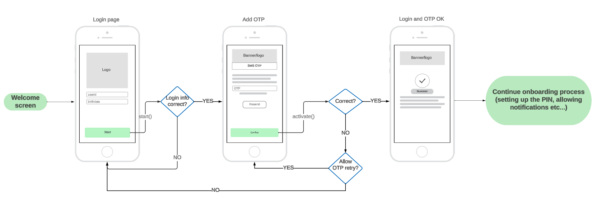

# Device Activation

With `ActivationService` you can onboard PowerAuth with just a piece of user information like his email, phone number, or login name.

PowerAuth enrolled in such a way will need [further user verification](Verifying-User.md) until fully operational (able to sign operations).

## Example app flow

<p align="center"></p>

## Creating an instance

To create an instance you will need a `PowerAuthSDK` instance that is __ready to be activated__, application `Context`, and configured `OkHttpClient`. Optionally, you can choose if the activation process will persist between instance re-creation (for example app restart).

<!-- begin box info -->
[Documentation for `PowerAuthSDK`](https://github.com/wultra/powerauth-mobile-sdk).  
<!-- end -->


Example:

```kotlin
val powerAuth = PowerAuthSDK
            .Builder(...)
            .build(appContext)
            
val activationService = ActivationService(
    "https://sever.my/path/", // identityserver URL
    appContext, // application context
    OkHttpClient.Builder(), // okhttp client that performs networking
    powerAuth
)
```

## Retrieving the status

To figure out if the activation process has already started and what is the status, you can use `hasActiveProcess()`.

```kotlin
/**
 * If the activation process is in progress.
 *
 * Note that when the result is `true` it can be already discontinued on the server.
 * Calling `status` in such case is recommended.
 */
public fun hasActiveProcess(): Bool
```

If the process was started, you can verify its status by calling the `status` function. You can show an appropriate UI to the user based on this status.

```kotlin
/**
 * Retrieves the status of the onboarding activation.
 *
 * @param callback Callback with the result.
 */
fun status(callback: (Result<Status>) -> Unit)
```

`Status` possible values.

```kotlin
enum class Status {
    /** Activation is in the progress */
    ACTIVATION_IN_PROGRESS,
    /** Activation was already finished, not waiting for the verification */
    VERIFICATION_IN_PROGRESS,
    /** Activation failed */
    FAILED,
    /** Both activation and verification were finished */
    FINISHED;
}
```

#### Example status check after app startup

```kotlin
class MyUserService {
    // prepared service
    private lateinit var activationService: ActivationService

    fun verifyStatus() {
        if (!activationService.hasActiveProcess()) {
            // no active process, show
            return
        }

        activationService.status { result ->
            result.onSuccess { status ->
                when (status) {
                    ActivationService.Status.ACTIVATION_IN_PROGRESS -> {
                        // activation is in progress, continue with OTP and `activate` method
                    }
                    ActivationService.Status.VERIFICATION_IN_PROGRESS -> {
                        // verification is in progress, continue with WDOVerificationService
                    }
                    ActivationService.Status.FINISHED -> {
                        // the process is finished and PowerAuthSDK instance activated
                        // show PIN login or other "default activated screen"
                    }
                    ActivationService.Status.FAILED -> {
                        // the activation failed (for example expired or was removed from the server),
                        // start again
                    }
                }
            }.onFailure { t ->
                // handle failure (internet not working, server down, etc..)
            }
        }
    }
}

```

## Starting the process

To start the activation process, you can use any credentials that are sufficient for you that identify the user.

Often, such data are user email, phone number, or userID with a combination of date of birth. The definition of such data is up to your server implementation and requirements.

To start the activation, use the `start` function.

```kotlin
/**
 * Starts onboarding activation with provided credentials.
 *
 * @param T Type that represents user credentials.
 * @param credentials Object with credentials. Which credentials are needed should be provided by a system/backend provider.
 * @param callback Callback with the result.
 */
fun <T> start(credentials: T, callback: (Result<Unit>) -> Unit)
```

### Example

```kotlin
data class UserData(
    val userID: String,
    val birthDate: String
)

class MyUserService {
    // prepared service
    private lateinit var activationService: ActivationService

    fun startActivation(id: String, bday: String) {
        val data = UserData(id, bday)
        activationService.start(data) { result ->
            result.onSuccess {
                // success, continue with `activate()`
                // at this moment, the `hasActiveProcess` starts return true
            }.onFailure {
                // show error to the user
            }
        }
    }
}
```

## Creating the activation

To activate the user (activating the `PowerAuthSDK` instance), data retrieved from the process start can be used with additional `OTP`. The OTP is usually sent via SMS, email, or other channel.

Use the `activate` function to create the activation.

```kotlin
/**
 * Activates PowerAuthSDK instance that was passed in the initializer.
 *
 * @param otp OTP provided by the user
 * @param activationName Name of the activation. Device name by default.
 * @param callback Callback with the result.
 */
fun activate(
    otp: String,
    activationName: String = Build.MODEL,
    callback: (Result<CreateActivationResult>) -> Unit
)
```

Example implementation:

```kotlin
class MyUserService {
    // prepared service
    private lateinit var activationService: ActivationService

    fun activate(smsOTP: String) {
        activationService.activate(smsOTP) { result ->
            result.onSuccess {
                // PowerAuthSDK instance was activated.
                // At this moment, navigate the user to
                // the PIN keyboard to finish the PowerAuthSDK initialization.
                // For more information, follow the PowerAuthSDK documentation.
            }.onFailure { 
                if (it is FailedApiException && it.allowOnboardingOtpRetry() == true) {
                    // User entered the wrong OTP, prompt for a new one.
                    // Remaining OTP attempts count: it.onboardingOtpRemainingAttempts()
                } else {
                    // show error UI
                }
            }
        }
    }
}
```

## Canceling the process

To cancel the process, just call the `cancel` function.

```kotlin
/**
 * Cancels the process.
 *
 * @param forceCancel When true, the process will be canceled in the SDK even when fails on the backend. `true` by default.
 * @param callback Callback with the result.
 */
fun cancel(forceCancel: Boolean = true, callback: (Result<Unit>) -> Unit) 
```

## OTP resend

In some cases, you need to resent the OTP:  
 - OTP was not received by the user (for example when the email ends in the spam folder).  
 - OTP expired. 

 For such cases, use the `resendOTP` function.
 
 ```kotlin
/**
 * Requests OTP resend.
 *
 * @param callback Callback with the result.
 */
fun resendOtp(callback: (Result<Unit>) -> Unit)
 ```
 
## Errors

All functions that can return an exception. The networking exceptions are by the type of `ApiErrorException` - more about these errors can be found in [the networking library documentation](https://github.com/wultra/networking-android).

There are 3 custom exceptions that this service is adding:

| Custom `WPNErrorReason` |      Description          |  
|--------------|---------------------|
| `ActivationInProgressException`  |  Activation is already in progress.         | 
| `ActivationNotRunningException`  |  Activation was not started. | 
| `CannotActivateException`  |  PowerAuth instance cannot start the activation (probably already activated). | 

## Read next
- [Verifying User With Document Scan And Genuine Presence Check](Verifying-User.md)