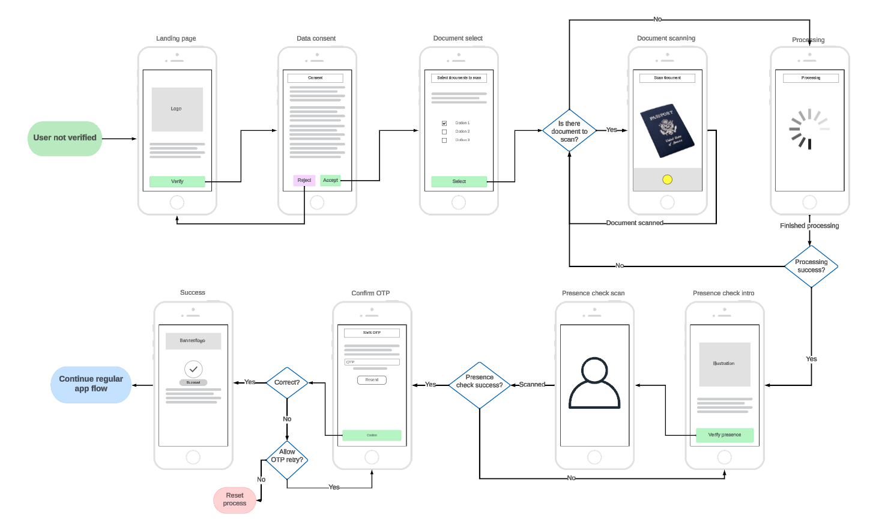

# Verifyng user

If your PowerAuthSDK instance was activated with the `VerificationService`, it will be in the state that needs additional verification. Without such verification, it won't be able to properly sign requests.

Additional verification means that the user will need to scan his face and documents like ID and/or passport.

## When is the verification needed?

Verification is needed if the `activationFlags` in the `io.getlime.security.powerauth.core.ActivationStatus` contains `VERIFICATION_PENDING` or `VERIFICATION_IN_PROGRESS` value.

These values can be accessed via the extension methods `verificationPending()` and `verificationInProgress()` or just simply `needVerification()` if one of them is true.

Example:

```kotlin
val powerAuth: PowerAuthSDK // configured and activated PowerAuth instance

powerAuthSDK.fetchActivationStatusWithCallback(
    appContext,
    object : IActivationStatusListener {
        override fun onActivationStatusSucceed(status: ActivationStatus) {
            // note that `needVerification()` method is an extension
            // from the `WultraDigitalOnboarding` space
            if (status.needVerification()) {
                // navigate to the verification flow 
                // and call `VerificationService.status`
            } else {
                // handle PA status
            }
        }

        override fun onActivationStatusFailed(t: Throwable) {
            // handle error
        }
    }
)
```

## Example app flow

<p align="center"></p>

<!-- begin box info -->
This mockup shows a __happy user flow__ of an example setup. Your usage may vary.   
The final flow (which screens come after another) is controlled by the backend.
<!-- end -->

## Server driven flow

- The screen that should be displayed is driven by the state on the server "session".   
- At the beginning of the verification process, you will call the status which will tell you what to display to the user and which function to call next.
- Each API call returns a result and a next screen to display.
- This repeats until the process is finished or an "endstate state" is presented which terminates the process.

## Possible state values

The service can return the state via the `status()` method or various other calls. The result of the status is a class that inherits from `VerificationStateData` and represents a screen in the verification flow.

### Intro

| `VerificationState` value | `VerificationStateData` class |  
|--------------|---------------------|
| `INTRO`  |  `VerificationStateIntroData` | 

Show the verification introduction screen where the user can start the activation.

The next step should be calling the `getConsentText()`.

### Consent

| `VerificationState` value | `VerificationStateData` class |  
|--------------|---------------------|
| `CONSENT`  |  `VerificationStateConsentData` with `val consentHtml: String` property | 

Show approve/cancel user consent.

The content of the text (in the `consentHtml` property) depends on the server configuration and might be plain text or HTML.

The next step should be calling the `consentApprove()`

### Select documents to scan

| `VerificationState` | `VerificationStateData` class |  
|--------------|---------------------|
| `DOCUMENTS_TO_SCAN_SELECT`  |  `VerificationStateDocumentsToScanSelectData` | 

Show document selection to the user. Which documents are available and how many can the user select is up to your backend configuration.  
The next step should be calling the `documentsSetSelectedTypes`.

### Scan document

| `VerificationState` | `VerificationStateData` class |  
|--------------|---------------------|
| `SCAN_DOCUMENT`  |  `VerificationStateScanDocumentData` with `val scanDocumentProcess: VerificationScanProcess` property | 

User should scan documents - display UI for the user to scan all necessary documents.

Which document should be scanned can be obtained via the `scanDocumentProcess` property.

The next step should be calling the `documentsSubmit`.

### Processing

| `VerificationState` | `VerificationStateData` class |  
|--------------|---------------------|
| `PROCESSING`  |  `VerificationStateProcessingData` with `val processingItem: ProcessingItem` property | 

The system is processing data - show loading with text hint from provided `ProcessingItem`.

The next step should be calling the `status`.

### Presence check

| `VerificationState` | `VerificationStateData` class |  
|--------------|---------------------|
| `PRESENCE_CHECK`  |  `VerificationStatePresenceCheckData` | 

The user should be presented with a presence check.  

Presence check is handled by third-party SDK based on the project setup.  

The next step should be calling the `presenceCheckInit` to start the check and `presenceCheckSubmit` to mark it finished  Note that these methods won't change the status and it's up to the app to handle the process of the presence check.

### OTP

| `VerificationState` | `VerificationStateData` class |  
|--------------|---------------------|
| `OTP`  |  `VerificationStateOtpData` with `val remainingAttempts: Int?` property | 

Show enter OTP screen with the resend button. `remainingAttempts` property contains a number of OTP attempts a user can try.

The next step should be calling the `verifyOTP` with the user-entered OTP. The OTP is usually SMS or email.

### Failed

| `VerificationState` | `VerificationStateData` class |  
|--------------|---------------------|
| `FAILED`  |  `VerificationStateFailedData` | 

Verification failed and can be restarted

The next step should be calling the `restartVerification` or `cancelWholeProcess` based on the user's decision if he wants to try it again or cancel the process.

### Endstate

| `VerificationState` | `VerificationStateData` class |  
|--------------|---------------------|
| `ENDSTATE`  |  `VerificationStateEndstateData` with `val endstateReason: EndstateReason` property | 

Verification is canceled and the user needs to start again with a new PowerAuth activation. To explain why that happened, you can show additional information to the user based on the `endstateReason` property.

The next step should be calling the `PowerAuthSDK.removeActivationLocal()` and starting activation from scratch.

### Success

| `VerificationState` | `VerificationStateData` class |  
|--------------|---------------------|
| `SUCCESS`  |  `VerificationStateSuccessData` | 

Verification was successfully ended. Continue into your app's regular "log-in" scenario.

## Creating an instance

To create an instance you will need a `PowerAuthSDK` instance that is __already activated__, application `Context`, and configured `OkHttpClient`.

<!-- begin box info -->
[Documentation for `PowerAuthSDK`](https://github.com/wultra/powerauth-mobile-sdk)
<!-- end -->


Example:

```kotlin
val powerAuth = PowerAuthSDK
            .Builder(...)
            .build(appContext)
            
val verificationService = VerificationService(
    "https://sever.my/path/", // identityserver URL
    appContext, // application context
    OkHttpClient.Builder(), // okhttp client that performs networking
    powerAuth
)
```

## Getting the verification status

When entering the verification flow for the first time (for example fresh app start), you need to retrieve the state of the verification.

The same needs to be done after some operation fails and it's not sure what is the next step in the verification process.

Most verification functions return the result and also the state for your convenience of "what next".

Getting the state directly:

```kotlin
lateinit var verification: VerificationService // configured instance
verification.status { result ->
    result.onSuccess { stateData ->
        // handle `VerificationService.Success` state and navigate to the expected screen
    }.onFailure { 
        if (it is VerificationService.Fail) {
            if (it.state != null) {
                // show expected screen based on the state
            } else {
                // navigate to error screen and show the error in
                // it.cause
            }
        } else {
            // generic exception handling
        }
    }
}
```

## Getting the user consent text

When the state is `INTRO`, the first step in the flow is to get the context text for the user to approve.

```kotlin
lateinit var verification: VerificationService // configured instance
verification.consentGet { result ->
    result.onSuccess { stateData ->
        if (stateData.state is VerificationStateConsentData) {
            // handle consent state
        }
    }.onFailure {
        if (it is VerificationService.Fail) {
            if (it.state != null) {
                // show expected screen based on the state
            } else {
                // navigate to error screen and show the error in
                // it.cause
            }
        } else {
            // generic exception handling
        }
    }
}
```

## Approving the user consent

When the state is `consent`, you should display the consent text to the user to approve or reject.

If the user __rejects the consent__, just return him to the intro screen, there's no API call for reject.

If the user chooses to accept the consent, call `consentApprove` function. If successful, `DOCUMENTS_TO_SCAN_SELECT ` state will be returned.

```kotlin
lateinit var verification: VerificationService // configured instance
verification.consentApprove { result ->
    result.onSuccess { stateData ->
        if (stateData.state is VerificationStateDocumentsToScanSelectData) {
            // handle consent state
        }
    }.onFailure {
        if (it is VerificationService.Fail) {
            if (it.state != null) {
                // show expected screen based on the state
            } else {
                // navigate to error screen and show the error in
                // it.cause
            }
        } else {
            // generic exception handling
        }
    }
}
```

## Set document types to scan

After the user approves the consent, present a document selector for documents which will be scanned. The number and types of documents (or other rules like 1 type required) are completely dependent on your backend system integration, frontend SDK does not provide any hint for this configuration.

For example, your system might require a national ID and one additional document like a driver's license, passport, or any other government-issued personal document.

```kotlin
lateinit var verification: VerificationService // configured instance
val list = listOf(DocumentType.ID_CARD,DocumentType.PASSPORT) // selected by user from UI or hardcoded
verification.documentsSetSelectedTypes(list) { result ->
    result.onSuccess { stateData ->
        if (stateData.state is VerificationStateScanDocumentData) {
            // handle consent state
        }
    }.onFailure {
        if (it is VerificationService.Fail) {
            if (it.state != null) {
                // show expected screen based on the state
            } else {
                // navigate to the error screen and show the error in
                // it.cause
            }
        } else {
            // generic exception handling
        }
    }
}
```

## Configuring the "Document Scan SDK"

<!-- begin box info -->
This step does not move the state of the process but is a "stand-alone" API call.
<!-- end -->

Since the document scanning itself is not provided by this library but by a 3rd party library, some of them need a server-side initialization.

If your chosen scanning SDK requires such a step, use this function to retrieve necessary data from the server.

ZenID integration example:

```kotlin
lateinit var verification: VerificationService // configured instance

if (ZenId.get().security.isAuthorized) {
    // the instance is already authorized
    return null
}

val token = ZenId.get().security.challengeToken

verification.documentsInitSDK(token) { result ->
    result.onSuccess { responseToken ->
        val success = ZenId.get().security.authorize(appContext, responseToken)
    }.onFailure {
        // handle error
    }
}
```

## Scanning a document

When the state of the process is `SCAN_DOCUMENT` with the `VerificationScanProcess` parameter, you need to present a document scan UI to the user. This UI needs
to guide through the scanning process - scanning one document after another and both sides (if the document requires so).

The whole UI and document scanning process is up to you and the 3rd party library you choose to use.

<!-- begin box warning -->
This step is the most complicated in the process as you need to integrate this SDK, another document-scanning SDK, and integrate your server-side expected logic. To
make sure everything goes as smoothly as possible, ask your project management to provide you with a detailed description/document of the required scenarios and expected documents
for your implementation.
<!-- end -->

## Uploading a document

When a document is scanned (both sides when required), it needs to be uploaded to the server.

<!-- begin box warning -->
__Images of the document should not be bigger than 1MB. Files that are too big will take longer time to upload and process on the server.__
<!-- end -->

To upload a document, use `documentsSubmit` function. Each side of a document is a single `DocumentFile` instance.

Example:

```kotlin
lateinit var verification: VerificationService // configured instance
val passportToUpload = DocumentFile(
    byteArrayOf(), // raw image data from the document scanning library/photo camera
    null, // signature onlu when supported by the backend
    DocumentType.PASSPORT,
    DocumentSide.FRONT, // passport has only front side
    null // use only when re-uploading the file (for example when first upload was rejected because of a blur)
)

verification.documentsSubmit(listOf(passportToUpload), { /* progress callback */ }) { result ->
    result.onSuccess {
        // state here will be "processing" - telling you that the file is being processed on the server
    }.onFailure {
        // handle error
    }
}
```

### `DocumentFile`

```kotlin
class DocumentFile {
    /** Image to be uploaded. */
    var data: ByteArray
    /** Image signature. */
    var dataSignature: String?
    /**Type of the document */
    val type: DocumentType
    /** Side of the document (null if the document is one-sided or only one side is expected) */
    val side: DocumentSide
    /** In case of re-upload */
    val originalDocumentId: String?

    /**
     * Image that can be send to the backend for Identity Verification
     *
     * @param scannedDocument Document which we're uploading
     * @param data: Image raw data
     * @param dataSignature: Signature of the image data. Optional, `null` by default
     * @param side: Side of the document which the image captures
     */
    constructor(scannedDocument: ScannedDocument, data: ByteArray, dataSignature: String? = null, side: DocumentSide)

    /**
     * Image that can be send to the backend for Identity Verification
     *
     * @param data: Image data to be uploaded.
     * @param dataSignature: Image signature
     * @param type: Type of the document
     * @param side: Side of the document (nil if the document is one-sided or only one side is expected)
     * @param originalDocumentId: Original document ID In case of a re-upload
     */
    constructor(data: ByteArray, dataSignature: String? = null, type: DocumentType, side: DocumentSide, originalDocumentId: String? = null)
}
```

<!-- begin box info -->
To create an instance of the `DocumentFile`, you can use `ScannedDocument.createFileForUpload`. The `ScannedDocument` is returned in the process status as a "next document to scan".
<!-- end -->

## Presence check

To verify that the user is present in front of the phone, a presence check is required. This is suggested by the `presenceCheck` state.

When this state is obtained, the following steps need to be done:

1. Call `presenceCheckInit` to initialize the presence check on the server. This call returns a dictionary of necessary data for the presence-check library to initialize.
2. Make the presence check by the third-party library
3. After the presence check is finished, call `presenceCheckSubmit` to tell the server you finished the process on the device.

## Verify OTP

After the presence check is finished, the user will receive an SMS/email OTP and the `OTP` state will be reported. When this state is received, prompt the user for the OTP and verify it via `verifyOTP` method.

The `OTP` state also contains the number of possible OTP attempts. When attempts are depleted, the error state is returned.

Example:

```kotlin
lateinit var verification: VerificationService // configured instance

val userOTP = "123456"

verification.verifyOTP(userOTP) { result ->
    result.onSuccess {
        // React to a new state returned in the result
    }.onFailure {
        // handle error
    }
}
```

## Success state

When a whole verification is finished, you will receive the `SUCCESS` state. Show a success screen and navigate the user to a common activated flow.

At the same time, the verification flags from the PowerAuth status are removed.

## Failed state

When the process fails, a `FAILED` state is returned. This means that the current verification process has failed and the user can restart it (by calling the `restartVerification` function) and start again (by showing the intro).

## Endstate state

When the activation is no longer able to be verified (for example did several failed attempts or took too long to finish), the `ENDSTATE` state is returned. In this state there's nothing the user can do to continue. `cancelWholeProcess` shall be called and `removeActivationLocal` should be called on the PowerAuthSDK object. After that, the user should be put into the "fresh install state".

## Read next

- [Language Configuration](Language-Configuration.md)